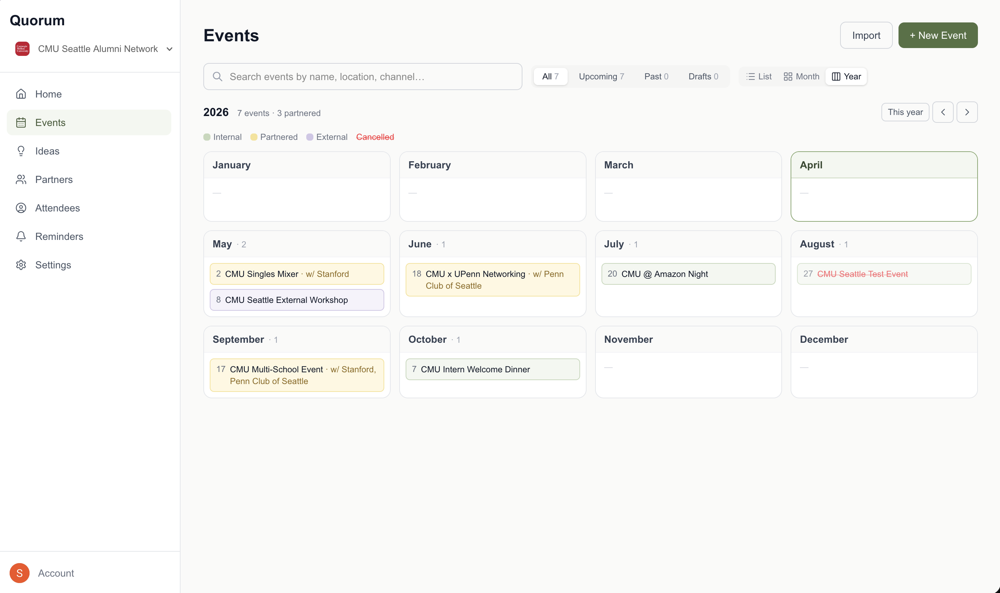
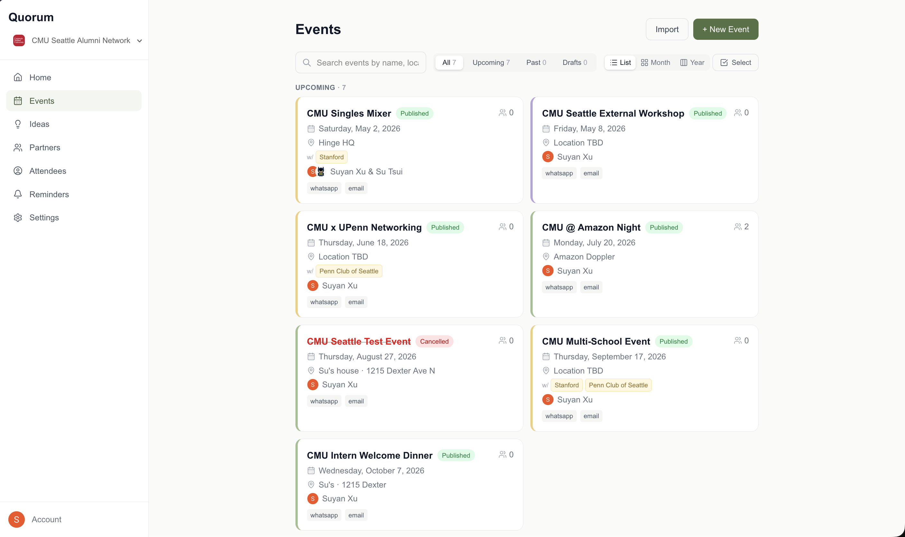
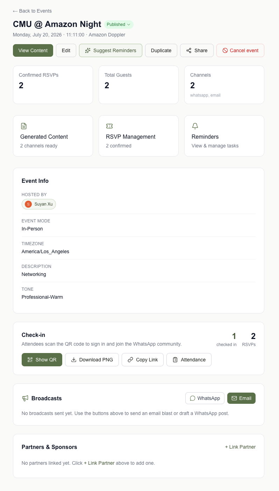
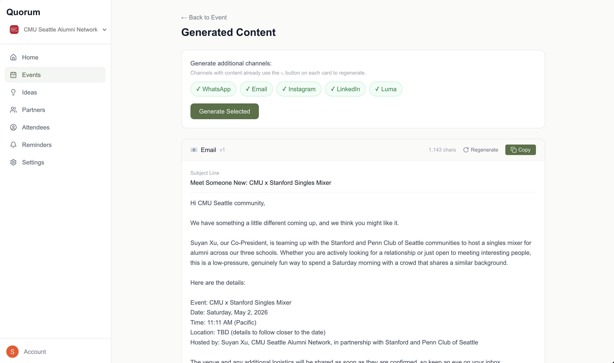
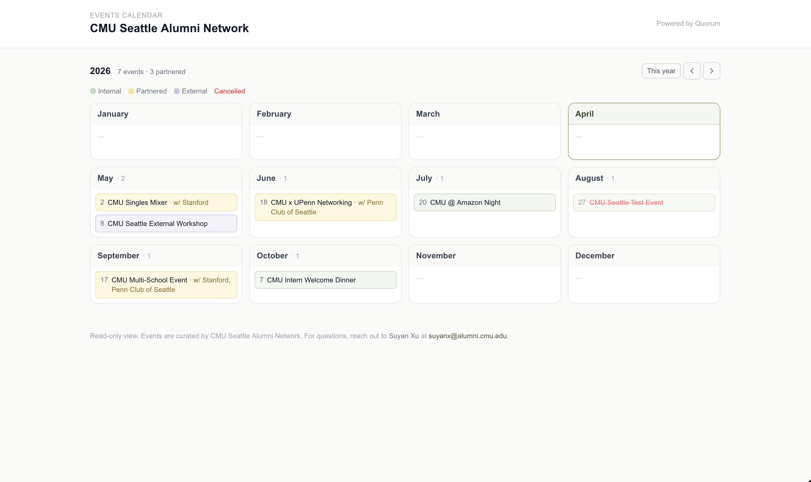

# Quorum

AI-native event OS for volunteer-led community organizations (alumni networks, clubs, professional groups). One event form in → ready-to-send content across WhatsApp, email, Instagram, LinkedIn, and Luma out. Plus RSVPs, check-in, partner CRM, smart reminders, email broadcasts, and a shareable public calendar.

**Live:** [quorum.suyan.dev](https://quorum.suyan.dev)

---

## What it does

1. **Fill out one event form** — core fields plus any custom fields your org uses. Form template is AI-parsed from your existing Google / Monday / Luma form URL.
2. **Generate channel content** — AI drafts WhatsApp, email, Instagram, LinkedIn, and Luma copy from a single event context, with prompt caching so 5 channels cost roughly what one does.
3. **Copy and send** — one tap per channel, or use the built-in broadcasts:
   - **Email broadcasts** via Resend to confirmed RSVPs, partners, or individuals
   - **WhatsApp click-to-send** deep links that open WhatsApp with your message pre-filled, so it ships from *your* account (authentic, no business badge)
4. **Track the lifecycle** — RSVPs (manual, paste-from-sheets, or CSV upload), public check-in QR + dynamic custom fields, attendance (RSVPed vs walk-in, no-show flagging), reminders assignable to team members with automated daily email delivery.
5. **Plan ahead** — ideas backlog for brainstorm-stage events, year-grid calendar with color-coded categories (internal / partnered / external), co-host picker that auto-syncs to the Partners CRM.
6. **Share with the board** — rotatable public calendar URL (`/c/<token>`) so board members see upcoming programming without needing a Quorum login.

## Screenshots

<p align="center">
  
  <br><sub>Year view — 12 months at a glance, color-coded by category (internal · partnered · external · cancelled)</sub>
</p>

<table>
  <tr>
    <td width="50%" align="center">
      
      <br><sub>Events list — category stripe + hosts + channels surfaced on each card</sub>
    </td>
    <td width="50%" align="center">
      
      <br><sub>Event detail — stats, check-in, broadcasts (email + WhatsApp), partners</sub>
    </td>
  </tr>
  <tr>
    <td width="50%" align="center">
      
      <br><sub>AI content — 5 channels from one event context, prompt-cached</sub>
    </td>
    <td width="50%" align="center">
      
      <br><sub>Public share URL — board members view upcoming events without a login</sub>
    </td>
  </tr>
</table>

## Stack

| Layer | Tool |
|---|---|
| Frontend | Next.js 16 (App Router) + React 19 + Tailwind v4 |
| Auth | Clerk (organizations mode, B2B multi-tenant) |
| Database | Neon Postgres (serverless HTTP driver, raw SQL, no ORM) |
| AI | Anthropic Claude Sonnet 4.6 (content, bulk imports) + Haiku 4.5 (reminders, partner emails, template parsing) with prompt caching |
| Email | Resend (broadcasts + daily reminder emails) |
| Cron | Vercel Cron — `/api/cron/reminders` runs daily |
| Hosting | Vercel (monorepo root = `apps/web`) |
| PWA | Next.js file-based manifest + dynamic icons via `next/og` |

Every query is scoped by `org_id` — multi-tenancy is enforced in [`apps/web/lib/auth.ts`](apps/web/lib/auth.ts) via `requireOrgMember()` / `requireAdmin()` gates on every API route.

## Repository layout

```
apps/web/                       Next.js app (frontend + API routes)
├── app/
│   ├── (auth)/                 Clerk sign-in / sign-up
│   ├── (dashboard)/            Authenticated org-scoped pages
│   │   ├── dashboard/          Home: stat strip + recent activity
│   │   ├── events/             List + year/month/list views + detail + edit + RSVPs + check-in
│   │   ├── ideas/              Event brainstorm backlog
│   │   ├── partners/           CRM with inline edit + event linking
│   │   ├── attendees/          Cross-event attendee lookup
│   │   ├── reminders/          Board-wide assignable reminders
│   │   ├── activity/           Audit log (linked from Settings)
│   │   └── settings/           Templates, roles, public share, contact
│   ├── c/[token]/              Public calendar pages (no auth)
│   ├── check-in/[eventId]/     Public check-in form
│   └── api/                    REST endpoints, webhooks, cron
├── components/                 UI grouped by feature
└── lib/                        db, ai, auth, email, co-hosts, errors, etc.

packages/db/
├── schema.sql                  Canonical DDL (source of truth for fresh setups)
└── migrations/                 Incremental migrations (001–013, idempotent IF NOT EXISTS)
```

## Local setup

Prerequisites: Node 20+, npm, a Neon database, a Clerk app, an Anthropic API key. Resend is optional (broadcasts + reminder emails no-op gracefully without it).

```bash
git clone https://github.com/suyanxv/cmu-community-os.git
cd cmu-community-os
npm install
cp .env.example apps/web/.env.local
# Fill in the env vars (see table below)

# Apply schema + all migrations to your Neon database, in order.
# Easiest: open Neon SQL Editor and paste each file 001..013 from
# packages/db/migrations/. Or via psql:
for f in packages/db/migrations/*.sql; do
  psql "$DATABASE_URL" -f "$f"
done

npm run --workspace=apps/web dev
```

Open `http://localhost:3000`. In Clerk dashboard → Webhooks, add an endpoint at `/api/webhooks/clerk` subscribed to `user.created`, `organization.created`, and `organizationMembership.created/updated/deleted`. That seeds local `users` + `org_members` rows when someone signs up or joins an org. If the webhook is unreliable, the Team section in Settings has a **Sync from Clerk** button that backfills manually.

### Environment variables

| Variable | Required | Purpose |
|---|---|---|
| `NEXT_PUBLIC_CLERK_PUBLISHABLE_KEY` | ✅ | Clerk client-side |
| `CLERK_SECRET_KEY` | ✅ | Clerk server-side |
| `CLERK_WEBHOOK_SECRET` | ✅ | Verifies Clerk webhook payloads |
| `DATABASE_URL` | ✅ | Neon connection string |
| `ANTHROPIC_API_KEY` | ✅ | Claude content generation + imports |
| `NEXT_PUBLIC_APP_URL` | recommended | Used for reminder email links, QR codes, public share URLs |
| `RESEND_API_KEY` | optional | Enables email broadcasts + reminder emails |
| `RESEND_FROM_EMAIL` | optional | Verified sender (a domain you control, or `onboarding@resend.dev` for testing) |
| `RESEND_FROM_NAME` | optional | Display name in the email "From" |
| `CRON_SECRET` | optional | Protects `/api/cron/reminders`; required for Vercel Cron to fire |
| `NEXT_PUBLIC_CLERK_SIGN_IN_URL` etc. | optional | Clerk path overrides (defaults are fine) |

Without the Resend vars, email broadcasts and daily reminder emails skip silently instead of erroring — the rest of the app works fine.

## Multi-tenancy

Every table has an `org_id` column. The auth layer resolves the Clerk `orgId` claim to the internal UUID and attaches it to the request context. All API handlers go through `requireOrgMember()` (or `requireAdmin()` for destructive actions) and `WHERE org_id = ${ctx.orgId}` on every query. No silent cross-org reads are possible.

## AI content generation

`POST /api/events/:id/generate` is the core product endpoint. The event's 20+ fields are assembled into a single XML context block that becomes the cached system prompt prefix. Each channel (WhatsApp / Email / Instagram / LinkedIn / Luma) is a separate user message with channel-specific constraints. With Claude's prompt caching, generating all 5 channels costs roughly the same input tokens as generating one.

Content style rules live in `apps/web/lib/ai.ts`:
- No em-dashes or en-dashes — punctuation stays conversational
- No "not only… but also" or AI-tell verbs (delve, leverage, utilize, embark, unlock)
- Channel character budgets enforced: WhatsApp 1,024 · Instagram 2,200 · LinkedIn 3,000 · Luma 500

## Custom event form templates

Orgs can paste their existing intake form (Monday / Google Forms / Luma URL, a pasted field list, or a text description) in Settings. The backend fetches URL content server-side, feeds the HTML to Claude Haiku, and extracts a structured schema. Saved in `organizations.settings.event_template_schema` and drives a dynamic form at `/events/new`. Core fields (name, date, channels, tone) stay fixed; custom fields live in `events.custom_fields` (JSONB) and flow into the AI prompt as extra context.

## Public calendar

Admins enable a read-only public URL (`/c/<128-bit-random-token>`) from Settings → Public calendar. It shows only published/past/cancelled events — drafts, RSVPs, internal notes, and partner contact info stay private. Viewers click through to a sanitized event detail page with date/time/location/agenda/speakers and the external RSVP link. Optional **public contact** (name + email) renders as a mailto link in the footer. Tokens are rotatable (invalidates distributed links) and fully disable-able.

## Daily reminder emails

Vercel Cron hits `/api/cron/reminders` daily at 14:00 UTC (secured by `CRON_SECRET`). It scans pending reminders where `due_date <= today` and `last_emailed_at IS NULL`, resolves recipients in order (assignee → event hosts → event creator), and sends via Resend. A conditional UPDATE guards against duplicate sends. Missing `RESEND_API_KEY` → the cron returns a graceful skip rather than failing.

## PWA

Users can "Add to Home Screen" on iOS/Android and get a fullscreen app shell with a sage "Q" icon. Manifest lives in `app/manifest.ts`; icons are dynamically generated by `app/icon.tsx` + `app/apple-icon.tsx` via `next/og` `ImageResponse` (no static PNGs to maintain).

## Roadmap

See [TODO.md](./TODO.md). Open items include:
- Recurring event series (monthly hikes, quarterly dinners)
- Dark mode
- Direct channel sending (Instagram Graph, LinkedIn API)
- Image uploads for events
- Analytics dashboard

## License

Private. Not currently open-sourced.
